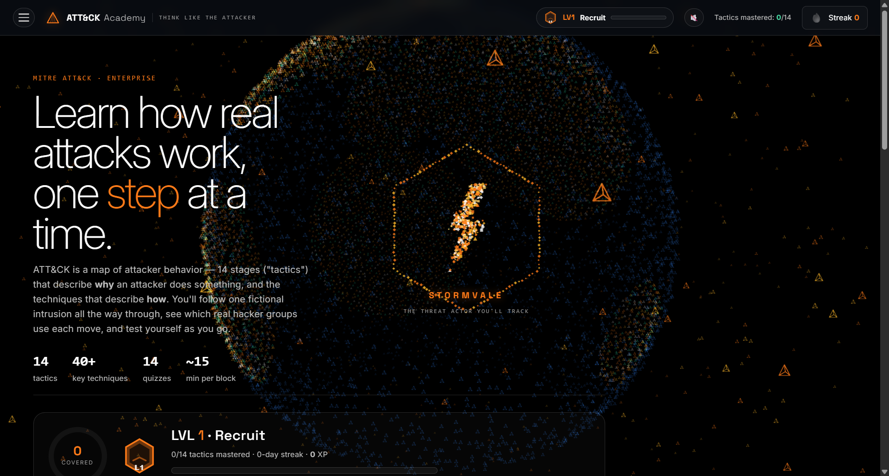

Mitre ATT&CK Academy

**Learn MITRE ATT&CK the way attackers think** — a gamified, single-file web app that walks you through a full intrusion, tactic by tactic, then drills you with quizzes and a realistic security-interview simulator.

> Built by **Harisankar S Prasad** — [LinkedIn](https://www.linkedin.com/in/harisankarsprasad)

---

## 🔗 Live demo

`https://harisankarsprasad.github.io/mitre-attack-academy/`

---

## What it is

A self-contained learning tool for the **14 MITRE ATT&CK Enterprise tactics**. You follow one fictional threat actor — **STORMVALE** — through a complete breach of a fictional bank, learning *why* attackers do each step and *how*, with the real-world groups and detections behind every technique.

It's designed for people studying for **SOC analyst, threat-intelligence and vulnerability-management** roles.

## Features

- **Story-driven curriculum** — all 14 tactics, each with the STORMVALE storyline, practitioner-level technique detail, and detection data sources (Sysmon IDs, event IDs, telemetry).
- **Real-world incidents** reframed as **Why / How / Succeeded?**, each with a freshly-researched 2025-26 update (Volt/Salt Typhoon, Scattered Spider, Cl0p, Lazarus/Bybit, LockBit 5.0, and more).
- **Linked threat groups** — every actor chip links to its verified MITRE ATT&CK group page with aliases.
- **Gamification** — XP, an operator rank ladder (Recruit → Adversary Emulator), achievement badges, a day-streak, and a cinematic level-up that recolors the whole UI.
- **Quizzes that don't cheat** — option order shuffles every load; the final exam is a distinct cross-tactic bank.
- **Interview Prep simulator** — 17 scenario + quick-fire questions on **threat intelligence and infrastructure vulnerability management**, with model answers.
- **Search**, **progress + level reset**, and a **minimizable sidebar**.
- **WebGL background** — a rotating particle globe with continents and attack arcs, cursor-reactive, with a 2D fallback when offline.
- **Persistent progress** via `localStorage` — your streak, mastery and rank survive refreshes.

## Tech

- Plain **HTML + CSS + JavaScript**, no build step, no framework.
- **Three.js** (CDN) for the WebGL globe, with a Canvas2D fallback.
- **Web Audio API** for subtle, optional UI sound.
- Everything lives in one file: `attack-academy.html`.

## Run it

**Locally:** open `attack-academy.html` in any modern browser. (Internet helps — the globe and fonts load from a CDN; offline it falls back gracefully.)

## Credits & data

Technique and group data is based on the public **MITRE ATT&CK®** knowledge base (https://attack.mitre.org). MITRE ATT&CK is a registered trademark of The MITRE Corporation; this is an independent educational project and is not affiliated with or endorsed by MITRE.

## Author

**Harisankar S Prasad** — Security analyst · Threat Intelligence & Vulnerability Management
[LinkedIn](https://www.linkedin.com/in/harisankarsprasad)

## License

© 2026 Harisankar S Prasad. **All rights reserved.** See [LICENSE](LICENSE). You may view it and link to it; please don't republish it as your own. Attribution required.
